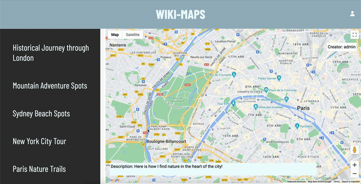
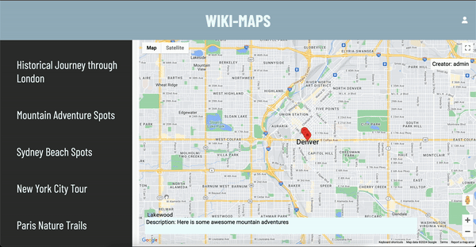
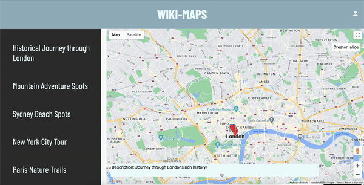
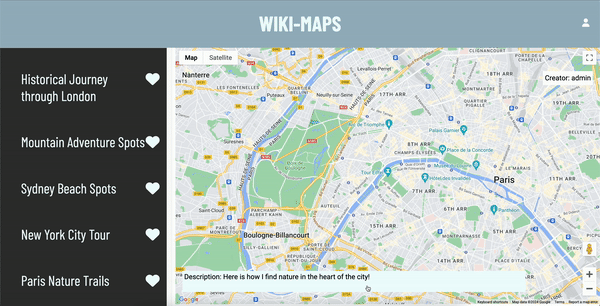
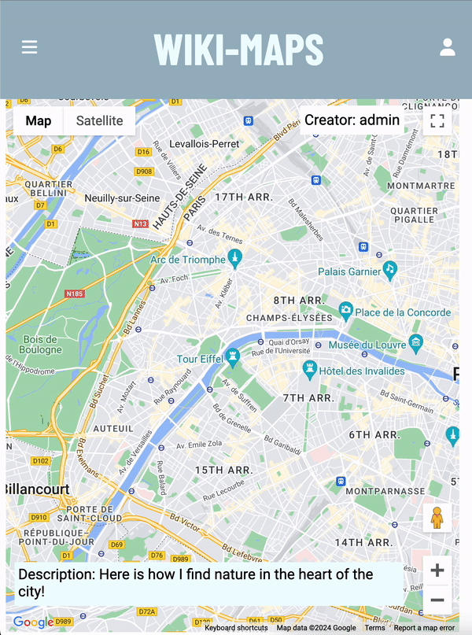
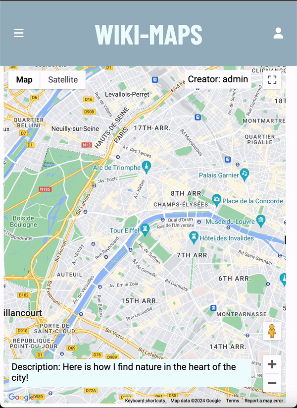

# WikiMaps

WikiMaps is a full-stack, single-page web application that allows users to share their favorite local spots in the form of maps and pins.

## Table of Contents

- [WikiMaps](#wikimaps)
  - [Table of Contents](#table-of-contents)
  - [About](#about)
  - [Features](#features)
  - [Dependencies](#dependencies)
  - [Installation](#installation)
  - [Contributors](#contributors)
  - [Final Product Screenshots](#final-product-screenshots)

## About

WikiMaps has been planned and built collaboratively in a team of 3, to showcase our full-stack development abilities, address the hard and soft skills needed to succeed on the job, and to simulate a work environment. Given a list of application requirements, we planned out and built the application over a 2 week period.

## Features

The key features of WikiMaps include:

- Users can create a map and add pins containing pictures and descriptions of their favorite spots. These will then be added to their profile.
- Users can add pins to each others maps.
- Users can edit existing pins.
- Users can favorite maps, which will then be added to their profile.
- Non-logged in users can view created maps.

## Dependencies

- Node 10.x or above
- NPM 5.x or above
- PG 6.x
- Google Maps js api-loader 1.16.6 or above
- Chalk 2.4.2 or above
- Cookie-session 2.1.0 or above
- Dotenv 2.0.0 or above
- EJS 2.6.2
- Express 4.17.1 or above
- Morgan 1.9.1 or above
- PG 8.11.5 or above
- SASS 1.35.1 or above
- UUID 9.0.1 or above
- Nodemon 2.0.10 or above (developer dependency)

## Installation

- Create the .env by using .env.example as a reference: cp .env.example .env

- Update the .env file with your correct local information
  * DB_HOST=localhost
  * DB_USER=YourUsername
  * DB_PASS=YourPassword
  * DB_NAME=YourDatabaseName
  * DB_PORT=5432
  * GOOGLE_MAPS_API=YourApiKey (You will need to acquire a google maps api key at: https://console.cloud.google.com/)

- Install dependencies: npm install

- Fix to binaries for sass: npm rebuild node-sass

- Reset database: npm run db:reset

- Check the db folder to see what gets created and seeded in the DB

- Run the server: npm run local
  * Note: nodemon is used, so you should not have to restart your server

- Visit http://localhost:8080/

- Use the npm run db:reset command each time there is a change to the database schema or seeds. This will run through each of the files, in order, and executes them against the database.

## Contributors

- Jeremiah Chua - https://github.com/Ametrysinine
- Vyshnavi Doulagar - https://github.com/vyshudoulagar
- Ben Hood - https://github.com/bhood239

## Final Product Screenshots
- Desktop views

- Mobile views

